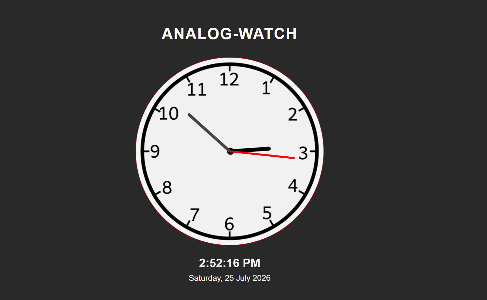

# Analog Watch — Real-Time Analog Clock

A responsive, real-time analog clock built with **HTML, CSS, and vanilla JavaScript**. It displays a rotating hour, minute, and second hand over a clock face image, along with a live digital time and date readout below it.

#Analog-Clock

## Features

- **Real-time analog display** — hour, minute, and second hands rotate continuously using JavaScript's `Date` object and CSS `transform: rotate()`.
- **Accurate hand movement** — the hour hand accounts for minute progression (`30° per hour + 0.5° per minute`) so it moves smoothly instead of jumping between hours.
- **Live digital clock** — current time shown via `toLocaleTimeString()`.
- **Live date display** — formatted using `toLocaleDateString()` with the `en-IN` locale, showing weekday, day, month, and year (e.g., *Saturday, 25 July 2026*).
- **Dark, modern UI** — a centered flex layout with a dark background, bold uppercase heading, and clean typography.

## How It Works

1. **HTML** sets up the structure: a container holding the clock face (`#clockContainer`) with three hand elements (`#hour`, `#minute`, `#second`), plus a section for the digital time and date.
2. **CSS** styles the clock face as a circular div with a background image, and positions each hand absolutely at the center with a `transform-origin: bottom`, so rotations pivot correctly around the clock's center.
3. **JavaScript**:
   - `setInterval` runs every second, reading the current hours, minutes, and seconds from `new Date()`.
   - Rotation angles are calculated (`6° per minute/second`, `30° per hour` plus a fractional offset for the hour hand) and applied via inline `transform: rotate(...)` styles.
   - A separate `updateDateTime()` function updates the digital time and formatted date every second.

## Concepts Demonstrated

- DOM manipulation with `getElementById`
- CSS `transform: rotate()` for animating clock hands
- `setInterval` for continuous, timed UI updates
- Locale-aware date/time formatting with `toLocaleTimeString()` / `toLocaleDateString()`

## Possible Improvements

- Use `requestAnimationFrame` instead of `setInterval` for smoother second-hand motion.
- Add a smooth "sweeping" second hand instead of tick-by-tick jumps.
- Make the clock face size responsive with `clamp()` for better scaling across devices.
- Add a light/dark theme toggle.
